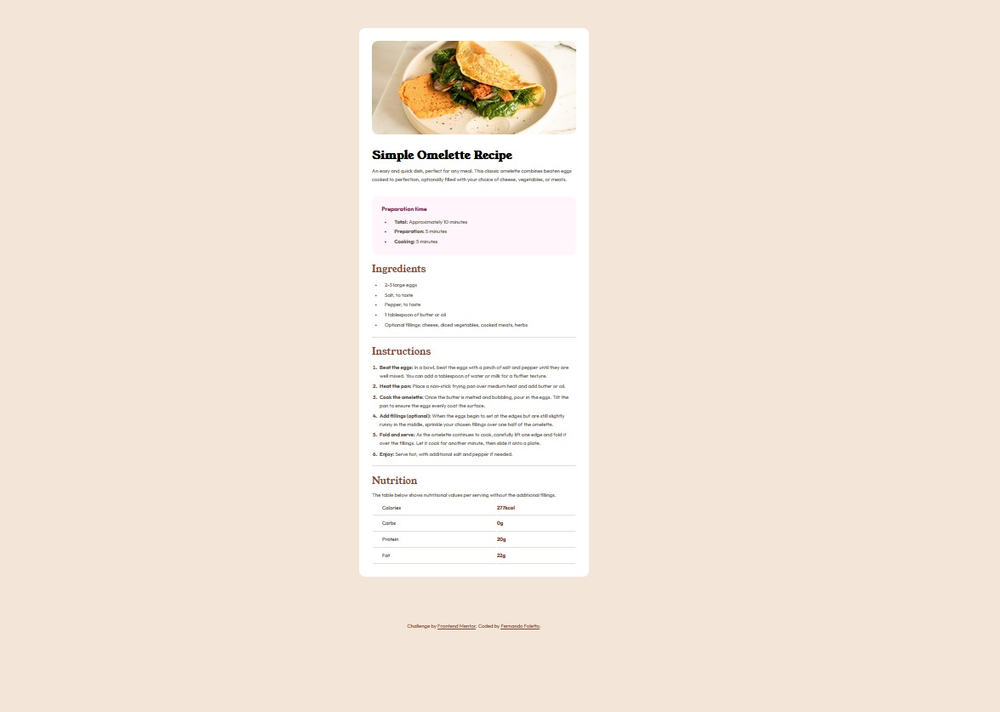

# Frontend Mentor - Recipe page

## Welcome! 👋

Thanks for checking out this front-end coding challenge.

### Screenshot

### Link

- Live Site URL: [https://fernandofoletto.github.io/recipePage/](https://fernandofoletto.github.io/recipePage/)

### Built with

- Semantic HTML5 markup
- CSS custom properties
- Flexbox
- BEM